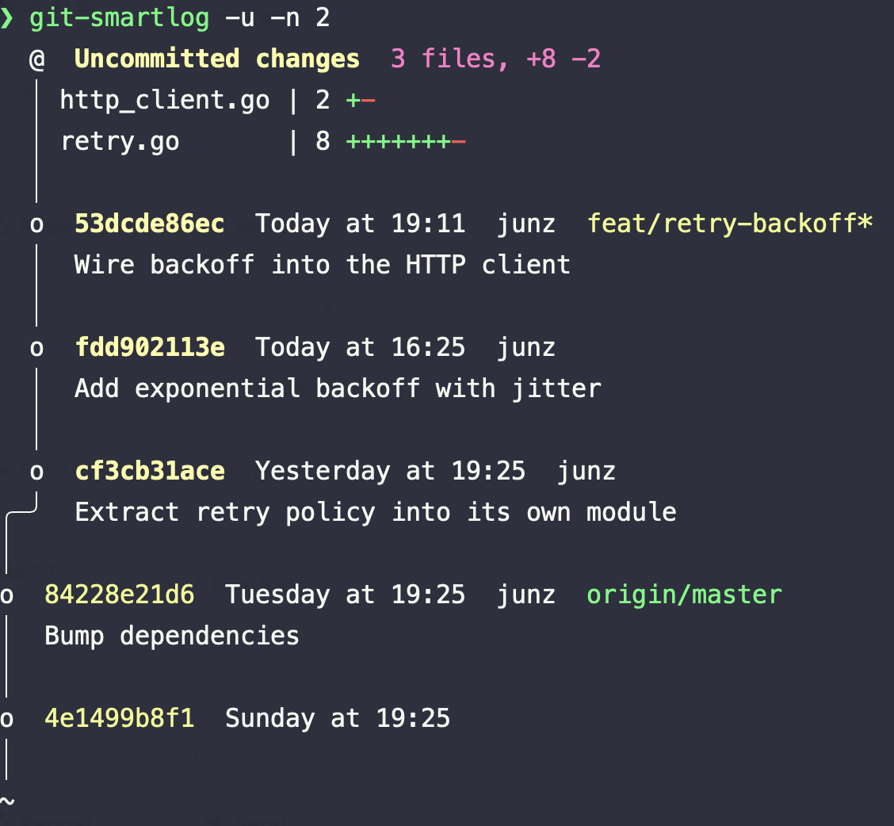

# git-smartlog

A [Sapling](https://sapling-scm.com/)-style `smartlog` for plain Git, in a single
self-contained zsh script.

It renders the current branch's **draft stack** — the first-parent chain of your
local (unpushed) commits — drawn on top of its nearest **public** (pushed) base,
with relative timestamps, authors, and ref decorations, closely mirroring the
output of Sapling's `sl` (the opt-in `-u` mode adds an uncommitted-changes node
that intentionally departs from that mirror — see below).

<p align="center">
  
</p>

## Example

On a feature branch with a few local commits stacked on `origin/master`:

```text
$ git smartlog
  @  23de132889  14 minutes ago  junz
  │  Wire backoff into the HTTP client
  │
  o  a8d1958eb9  Today at 10:30  junz
  │  Add exponential backoff with jitter
  │
  o  2d6999d80d  Today at 08:05  junz
╭─╯  Extract retry policy into its own module
│
o  7582005a1c  Yesterday at 16:45  junz  origin/master
│  Bump dependencies
~
```

`@` marks `HEAD`; the indented `o` nodes above the bend (`╭─╯`) are your unpushed
draft commits, newest first. Below the bend sits the public base — the nearest
pushed commit, here `origin/master` — and `~` marks the truncated history beyond
it.

Widen the public window with `-n`. Public commits authored by *someone else*
render metadata-only (no author, no subject), exactly as Sapling does — see
`a7b65c2438` below:

```text
$ git smartlog -n 5
  @  23de132889  14 minutes ago  junz
  │  Wire backoff into the HTTP client
  │
  o  a8d1958eb9  Today at 10:30  junz
  │  Add exponential backoff with jitter
  │
  o  2d6999d80d  Today at 08:05  junz
╭─╯  Extract retry policy into its own module
│
o  7582005a1c  Yesterday at 16:45  junz  origin/master
│  Bump dependencies
│
o  a7b65c2438  Yesterday at 09:30
│
│
o  91eb0d1793  Wednesday at 14:20  junz
│  Add config loader and defaults
~
```

With `-u` / `--uncommitted`, a synthetic **Uncommitted changes** node is drawn on
top of `HEAD` whenever the working tree is dirty: compact totals in the header,
per-file `git diff --stat HEAD` bars in the body. The `@` marker moves to it —
that's where the working copy is — and `HEAD` drops to an `o` (keeping its author
and subject). This is a git-smartlog extension with no Sapling equivalent, so the
output no longer mirrors `sl` (see [Differences](#differences-from-saplings-sl)):

```text
$ git smartlog -u
  @  Uncommitted changes  2 files, +26 -4
  │ http_client.go | 18 ++++++++++++++----
  │ retry.go       | 12 ++++++++++++
  │
  o  23de132889  14 minutes ago  junz
  │  Wire backoff into the HTTP client
  │
  o  a8d1958eb9  Today at 10:30  junz
╭─╯  Add exponential backoff with jitter
│
o  7582005a1c  Yesterday at 16:45  junz  origin/master
│  Bump dependencies
~
```

In a real terminal the output is colorized — draft hashes in bold yellow,
`HEAD`'s line in magenta, remote refs in green. ANSI is suppressed when stdout
isn't a TTY (as in these captures) or when `NO_COLOR` is set.

## Requirements

- `zsh`
- `git`

That's it. The script sources nothing else, so you can drop it anywhere on your
`PATH` and run it.

## Install

```sh
curl -fsSL https://raw.githubusercontent.com/junzh0u/git-smartlog/master/git-smartlog \
  -o ~/.local/bin/git-smartlog
chmod +x ~/.local/bin/git-smartlog
```

Because the script is named `git-smartlog` and lives on your `PATH`, Git picks it
up as a subcommand — run it as `git smartlog`. A short alias is handy:

```sh
git config --global alias.sl smartlog
```

## Usage

```
usage: git-smartlog [-u] [-n N] [--base REV]

  -u, --uncommitted   show a synthetic node for uncommitted working-tree changes
  -n, --limit N       public commits to show, including the merge-base (default 1)
      --base REV      override the public base (default: nearest remote trunk, e.g.
                      origin/HEAD, origin/main, origin/master, upstream/main)
  -h, --help          show this help and exit
```

## How it works

- **Public base** — the nearest public ancestor of `HEAD`. Candidate trunks are
  remote-tracking refs only (`origin/HEAD`, `upstream/HEAD`, `origin/main`,
  `origin/master`, `upstream/main`, `upstream/master`); among those, the one whose
  merge-base with `HEAD` is closest to `HEAD` wins. `@{u}` and a local
  `main`/`master` are last-resort fallbacks when no remote trunk exists.
- **Drafts** — first-parent commits in `HEAD ^base`, newest first.
- **Uncommitted changes** — with `-u`/`--uncommitted`, when `git status` is
  non-empty, a synthetic node on top of `HEAD`: compact totals in the header
  (`git diff --shortstat` plus the untracked-file count), per-file
  `git diff --stat HEAD` bars in the body; the `@` marker moves there.
- **Public window** — `-n` commits starting at the base.
- **Relative time** — mirrors Sapling's `smartdate`: `age()` ("N minutes ago")
  within 90 minutes, calendar-day `simpledate()` ("Yesterday", "Mon DD", …)
  beyond it.
- **Color** — ANSI, automatically suppressed when stdout isn't a TTY or `NO_COLOR`
  is set.

## Differences from Sapling's `sl`

- **Single stack only.** It renders the current `HEAD`'s first-parent draft chain
  plus its public base. Sapling renders *every* draft branch as its own stack via
  a full DAG renderer; this script deliberately does not, so other local branches
  and draft heads won't appear. Output matches `sl` exactly when you're working a
  single branch (the common case).
- **Long subjects shown in full.** Sapling truncates them to the terminal width
  with an ellipsis.
- **`-u` is an extension, not a mirror.** The default output tracks Sapling's `sl`
  closely, but the `-u`/`--uncommitted` node (with its `git diff --stat` body) has
  no Sapling equivalent — Sapling surfaces working-copy changes differently. Treat
  `-u` as a git-smartlog-only convenience, not a parity feature.

## License

[MIT](LICENSE)
