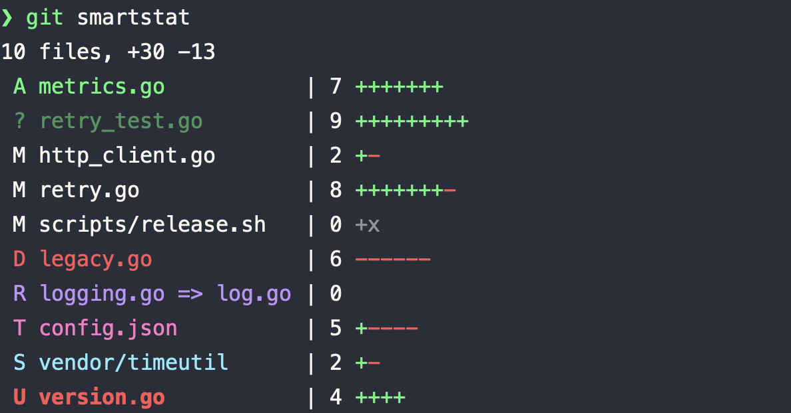

# git-smartlog

A [Sapling](https://sapling-scm.com/)-style `smartlog` for plain Git, in a single
self-contained zsh script. The same file doubles as
[`git-smartstat`](#git-smartstat), a standalone view of uncommitted changes.

It renders the current branch's **draft stack** — the first-parent chain of your
local (unpushed) commits — drawn on top of its nearest **public** (pushed) base,
with relative timestamps, authors, and ref decorations, closely mirroring the
output of Sapling's `sl` (the opt-in `-u` mode adds an uncommitted-changes node
that intentionally departs from that mirror — see below).

The story behind it — and how the public base is found — is in
[this post](https://junz.info/writing/git-smartlog/).

<p align="center">
  
</p>

## Example

On a feature branch with a few local commits stacked on `origin/master`:

```text
$ git smartlog
  @  b82a2561e9  14 minutes ago  junz  feat/retry-backoff*
  │  Wire backoff into the HTTP client
  │
  o  98f650bc74  Today at 11:26  junz
  │  Add exponential backoff with jitter
  │
  o  50faf770f4  Yesterday at 14:26  junz
╭─╯  Extract retry policy into its own module
│
o  5c4369ce49  Wednesday at 14:26  junz  origin/master
│  Bump dependencies
~
```

`@` marks `HEAD`; the indented `o` nodes above the bend (`╭─╯`) are your unpushed
draft commits, newest first. Below the bend sits the public base — the nearest
pushed commit, here `origin/master` — and `~` marks the truncated history beyond
it.

Widen the public window with `-n`. Public commits authored by *someone else*
render metadata-only (no author, no subject), exactly as Sapling does — see
`2c8c874b9c` below:

```text
$ git smartlog -n 5
  @  b82a2561e9  14 minutes ago  junz  feat/retry-backoff*
  │  Wire backoff into the HTTP client
  │
  o  98f650bc74  Today at 11:26  junz
  │  Add exponential backoff with jitter
  │
  o  50faf770f4  Yesterday at 14:26  junz
╭─╯  Extract retry policy into its own module
│
o  5c4369ce49  Wednesday at 14:26  junz  origin/master
│  Bump dependencies
│
o  2c8c874b9c  Monday at 14:26
│
│
o  91eb0d1793  Jun 05 at 09:30  junz
│  Add config loader and defaults
~
```

With `-u` / `--uncommitted`, a synthetic **Uncommitted changes** node is drawn on
top of `HEAD` whenever the working tree is dirty: compact totals in the header,
per-file `git diff --stat HEAD` bars in the body. Untracked files are folded into
both (as new-file additions) via a throwaway index overlay, so they appear without
touching the real index. Each body filename is prefixed with a one-letter change
marker, and both marker and name are color-coded by kind, on top of git's usual
green/red `+`/`-` bars. The body is **grouped by marker**, in the order below
(alphabetical within each group):

| marker | meaning | color |
| :-: | --- | --- |
| `A` | added (staged) | green |
| `?` | untracked | dim green |
| `M` | modified | default |
| `D` | deleted | red |
| `R` | renamed | blue |
| `T` | typechange (file↔symlink) | magenta |
| `S` | submodule | cyan |
| `U` | unmerged (conflict) | bold red |

A pure executable-bit flip (`chmod`), which `--stat` renders as `| 0`, gets a
trailing `+x`/`-x` hint. The `@` marker moves to the node — that's where the working
copy is — and `HEAD` drops to an `o` (keeping its author and subject). This is a
git-smartlog extension with no Sapling equivalent, so the output no longer mirrors
`sl` (see [Differences](#differences-from-saplings-sl)):

```text
$ git smartlog -u -n 2
  @  Uncommitted changes  10 files, +30 -13
  │  A metrics.go           | 7 +++++++
  │  ? retry_test.go        | 9 +++++++++
  │  M http_client.go       | 2 +-
  │  M retry.go             | 8 +++++++-
  │  M scripts/release.sh   | 0 +x
  │  D legacy.go            | 6 ------
  │  R logging.go => log.go | 0
  │  T config.json          | 5 +----
  │  S vendor/timeutil      | 2 +-
  │  U version.go           | 4 ++++
  │
  o  b82a2561e9  14 minutes ago  junz  feat/retry-backoff*
  │  Wire backoff into the HTTP client
  │
  o  98f650bc74  Today at 11:26  junz
  │  Add exponential backoff with jitter
  │
  o  50faf770f4  Yesterday at 14:26  junz
╭─╯  Extract retry policy into its own module
│
o  5c4369ce49  Wednesday at 14:26  junz  origin/master
│  Bump dependencies
│
o  2c8c874b9c  Monday at 14:26
│
~
```

In a real terminal the output is colorized — draft hashes in bold yellow,
`HEAD`'s line in magenta, remote refs in green. ANSI is suppressed when stdout
isn't a TTY (as in these captures) or when `NO_COLOR` is set.

## Requirements

- `zsh`
- `git`

That's it. The script sources nothing else, so you can drop it anywhere on your
`PATH` and run it — `-u` included, since its stat block is computed in-file (see
[git-smartstat](#git-smartstat)).

## Install

```sh
curl -fsSL https://raw.githubusercontent.com/junzh0u/git-smartlog/master/git-smartlog \
  -o ~/.local/bin/git-smartlog
chmod +x ~/.local/bin/git-smartlog
# optional: the same file doubles as `git smartstat` (see below)
ln -s git-smartlog ~/.local/bin/git-smartstat
```

Because the script is named `git-smartlog` and lives on your `PATH`, Git picks it
up as a subcommand — run it as `git smartlog`. A short alias is handy:

```sh
git config --global alias.sl smartlog
```

## Usage

```
usage: git-smartlog [-u] [-n N] [--base REV]

  -u, --uncommitted   show a synthetic node for uncommitted working-tree changes
  -n, --limit N       public commits to show, including the merge-base (default 1)
      --base REV      override the public base (default: nearest remote trunk, e.g.
                      origin/HEAD, origin/main, origin/master, upstream/main)
  -h, --help          show this help and exit
```

## git-smartstat

The uncommitted-changes block isn't just an add-on to the graph — it's also useful
on its own. `git-smartlog` is **multi-call**: the same file, invoked under the name
`git-smartstat`, prints *only* that block (the exact body `-u` draws) as a
standalone command. Symlink it and you get `git smartstat`:

```sh
ln -s git-smartlog ~/.local/bin/git-smartstat
```

```
usage: git-smartstat [--color WHEN]

      --color WHEN    colorize output: auto (default), always, or never
  -h, --help          show this help and exit
```

```text
$ git smartstat
10 files, +30 -13
 A metrics.go           | 7 +++++++
 ? retry_test.go        | 9 +++++++++
 M http_client.go       | 2 +-
 M retry.go             | 8 +++++++-
 M scripts/release.sh   | 0 +x
 D legacy.go            | 6 ------
 R logging.go => log.go | 0
 T config.json          | 5 +----
 S vendor/timeutil      | 2 +-
 U version.go           | 4 ++++
```

<p align="center">
  
</p>

It prints nothing when the working tree is clean. Both names share one in-file
function (`uncommitted_stat`), so there's no duplicated logic and `git-smartlog`
stays a single self-contained file — `-u` needs nothing external. (Standalone,
`git-smartstat` also works in a repo with no commits yet, diffing against the
empty tree so staged and untracked files still show as additions.)

## How it works

- **Public base** — the nearest public ancestor of `HEAD`. Candidate trunks are
  remote-tracking refs only (`origin/HEAD`, `upstream/HEAD`, `origin/main`,
  `origin/master`, `upstream/main`, `upstream/master`); among those, the one whose
  merge-base with `HEAD` is closest to `HEAD` wins. `@{u}` and a local
  `main`/`master` are last-resort fallbacks when no remote trunk exists.
- **Drafts** — first-parent commits in `HEAD ^base`, newest first.
- **Uncommitted changes** — with `-u`/`--uncommitted`, when `git status` is
  non-empty, a synthetic node on top of `HEAD`: compact totals in the header
  (`git diff --shortstat`) and per-file `git diff --stat HEAD` bars in the body,
  both computed against a throwaway index overlay that intent-to-adds untracked
  files so they're folded in without mutating the repo. Each body filename gets a
  one-letter change marker (`A`/`?`/`M`/`D`/`R`/`T`/`S`/`U`, from `git diff --raw`,
  plus the porcelain status for conflicts) colored by kind (see the `-u` table
  above), and a `+x`/`-x` hint on executable-bit flips; the `@`
  marker moves there. This block is computed by the in-file `uncommitted_stat`
  function — the same code the [`git-smartstat`](#git-smartstat) command runs.
- **Public window** — `-n` commits starting at the base.
- **Relative time** — mirrors Sapling's `smartdate`: `age()` ("N minutes ago")
  within 90 minutes, calendar-day `simpledate()` ("Yesterday", "Mon DD", …)
  beyond it.
- **Color** — ANSI, automatically suppressed when stdout isn't a TTY or `NO_COLOR`
  is set.

## Differences from Sapling's `sl`

- **Single stack only.** It renders the current `HEAD`'s first-parent draft chain
  plus its public base. Sapling renders *every* draft branch as its own stack via
  a full DAG renderer; this script deliberately does not, so other local branches
  and draft heads won't appear. Output matches `sl` exactly when you're working a
  single branch (the common case).
- **Long subjects shown in full.** Sapling truncates them to the terminal width
  with an ellipsis.
- **`-u` is an extension, not a mirror.** The default output tracks Sapling's `sl`
  closely, but the `-u`/`--uncommitted` node (with its `git diff --stat` body) has
  no Sapling equivalent — the idea is borrowed from [Jujutsu](https://github.com/jj-vcs/jj),
  which treats the working copy as a commit in its own right; Sapling surfaces
  working-copy changes differently. Treat `-u` as a git-smartlog-only convenience,
  not a parity feature.

## License

[MIT](LICENSE)
