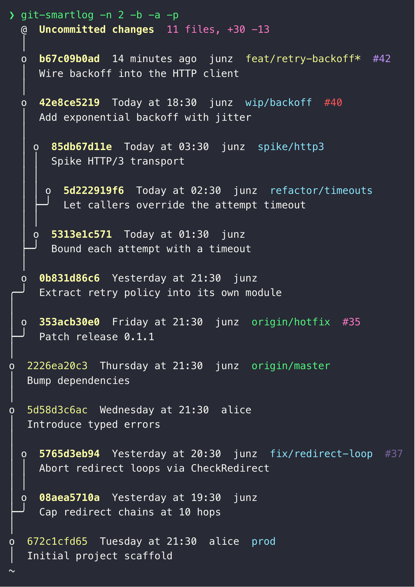
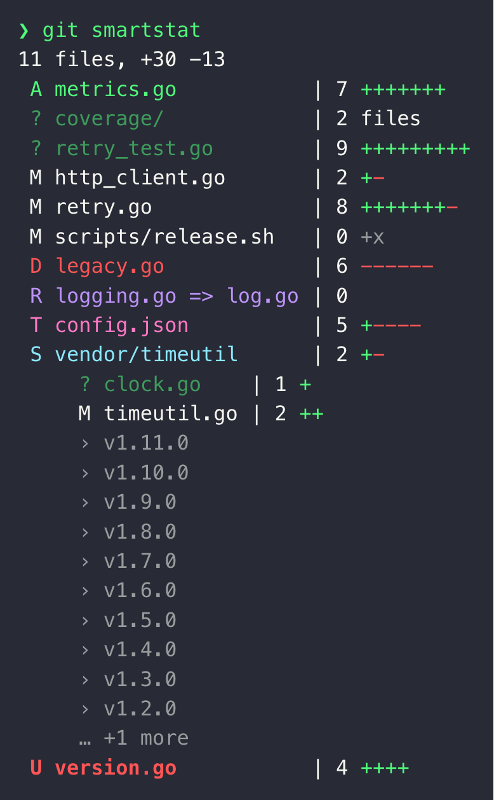

# git-smartlog

A [Sapling](https://sapling-scm.com/)-style `smartlog` for plain Git, in a single
self-contained zsh script. The same file doubles as
[`git-smartstat`](#git-smartstat), a standalone view of uncommitted changes.

It renders the current branch's **draft stack** — the first-parent chain of your
local (unpushed) commits — drawn on top of its nearest **public** (pushed) base,
with relative timestamps, authors, and ref decorations, closely mirroring the
output of Sapling's `sl`. Four things depart from that mirror: a dirty working
tree always draws an uncommitted-changes node, and three independent flags —
`-c` for per-file change stats under your commits, `-b` to fold your other local
branches into the graph as full stacks, `-a` to stop compacting other people's
public commits — combine freely on top. See below.

The story behind it is in
[this post](https://junz.info/writing/git-smartlog/).

<p align="center">
  
</p>

## Example

On a feature branch with a few local commits stacked on `origin/master`:

```text
$ git smartlog
  @  498df929d5  Today at 09:33  junz  feat/retry-backoff*
  │  Wire backoff into the HTTP client
  │
  o  ba482d2f0b  Today at 06:47  junz
  │  Add exponential backoff with jitter
  │
  o  fa8075adfb  Yesterday at 09:47  junz
╭─╯  Extract retry policy into its own module
│
o  c7283c280b  Wednesday at 09:47  junz  origin/master
│  Bump dependencies
~
```

`@` marks `HEAD`; the indented `o` nodes above the bend (`╭─╯`) are your unpushed
draft commits, newest first. Below the bend sits the public base — the nearest
pushed commit, here `origin/master` — and `~` marks the truncated history beyond
it.

Widen the public window with `-n`. Public commits authored by *someone else*
render metadata-only (no author, no subject), exactly as Sapling does — see
`a21fc72b55` and `80cf810025` below. Pass `-a` / `--all-authors` to turn that
off and show the author and subject for every commit, including other people's
public ones:

```text
$ git smartlog -n 4
  @  498df929d5  Today at 09:33  junz  feat/retry-backoff*
  │  Wire backoff into the HTTP client
  │
  o  ba482d2f0b  Today at 06:47  junz
  │  Add exponential backoff with jitter
  │
  o  fa8075adfb  Yesterday at 09:47  junz
╭─╯  Extract retry policy into its own module
│
o  c7283c280b  Wednesday at 09:47  junz  origin/master
│  Bump dependencies
│
o  a21fc72b55  Tuesday at 09:47
│
│
o  80cf810025  Monday at 09:47
│
~
```

A synthetic **Uncommitted changes** node is drawn on top of `HEAD` whenever the
working tree is dirty — no flag needed: compact totals in the header,
per-file `git diff --stat HEAD` bars in the body. Loose untracked files are folded
into both (as new-file additions) via a throwaway index overlay, so they appear
without touching the real index; a **wholly-untracked directory collapses to a
single `dir/ | N files` entry** instead of expanding to every file inside it, just
like `git status`. Each body filename is prefixed with a one-letter change marker,
and both marker and name are color-coded by kind, on top of git's usual green/red
`+`/`-` bars. The body is **grouped by marker**, in the order below (sorted by path
within each group, matching `git status`):

| marker | meaning | color |
| :-: | --- | --- |
| `A` | added (staged) | green |
| `?` | untracked | dim green |
| `M` | modified | default |
| `D` | deleted | red |
| `R` | renamed | blue |
| `T` | typechange (file↔symlink) | magenta |
| `S` | submodule | cyan |
| `U` | unmerged (conflict) | bold red |

A pure executable-bit flip (`chmod`), which `--stat` renders as `| 0`, gets a
trailing `+x`/`-x` hint. A **submodule** (`S`) expands into sub-lines under its
stat line, in two groups of at most 3 lines each, each closing with a dim
`… +N more` when it overflows:

- its own **uncommitted changes** — this same stat block, recomputed inside the
  submodule and indented one level in, keeping its markers, colors and bars (a
  dirty submodule inside it nests again). Without this a merely dirty submodule
  says nothing at all: its recorded sha is unchanged, so git renders it as a bare
  `| 0`.
- the commits its pointer **gained or lost**, from `git diff --submodule=log`,
  newest first and dim — `›` for one gained, `‹` for one lost (a rewind); a bump
  git can't summarize (commits not present locally) adds none.

The `@` marker moves to the node — that's where the working
copy is — and `HEAD` drops to an `o` (keeping its author and subject). This is a
git-smartlog extension with no Sapling equivalent, so the output no longer mirrors
`sl` (see [Differences](#differences-from-saplings-sl)):

```text
$ git smartlog -n 2
  @  Uncommitted changes  10 files, +30 -13
  │  A metrics.go           | 7 +++++++
  │  ? retry_test.go        | 9 +++++++++
  │  M http_client.go       | 2 +-
  │  M retry.go             | 8 +++++++-
  │  M scripts/release.sh   | 0 +x
  │  D legacy.go            | 6 ------
  │  R logging.go => log.go | 0
  │  T config.json          | 5 +----
  │  S vendor/timeutil      | 2 +-
  │      ? clock.go    | 1 +
  │      M timeutil.go | 2 ++
  │      › v1.5.0
  │      › v1.4.0
  │      › v1.3.0
  │      … +2 more
  │  U version.go           | 4 ++++
  │
  o  498df929d5  Today at 09:33  junz  feat/retry-backoff*
  │  Wire backoff into the HTTP client
  │
  o  ba482d2f0b  Today at 06:47  junz
  │  Add exponential backoff with jitter
  │
  o  fa8075adfb  Yesterday at 09:47  junz
╭─╯  Extract retry policy into its own module
│
o  c7283c280b  Wednesday at 09:47  junz  origin/master
│  Bump dependencies
│
o  a21fc72b55  Tuesday at 09:47
│
~
```

With `-c` / `--changes`, that same per-file stat block attaches to **every commit
in the current stack**, clean or dirty (against each commit's first parent), with
the uncommitted node still on top; sitting directly on the trunk (no stack), it
covers **every public commit in view** instead — pair it with `-n` to review
recent history. Bodies share the uncommitted node's markers, colors, and
grouping, and close with a dim `N files, +X -Y` total line (that node keeps its
total in the header):

```text
$ git smartlog -c
  @  Uncommitted changes  1 file, +9 -0
  │  ? retry_test.go | 9 +++++++++
  │
  o  498df929d5  Today at 09:33  junz  feat/retry-backoff*
  │  Wire backoff into the HTTP client
  │  M http_client.go | 2 +-
  │  M retry.go       | 8 +++++++-
  │  2 files, +9 -1
  │
  o  ba482d2f0b  Today at 06:47  junz
  │  Add exponential backoff with jitter
  │  A retry.go | 41 ++++++++++++++++++++++
  │  1 file, +41 -0
╭─╯
│
o  c7283c280b  Wednesday at 09:47  junz  origin/master
│  Bump dependencies
~
```

With `-b` / `--branches`, every **other local branch** joins the graph too, each
rendering its **complete stack**, exactly as Sapling draws it. All heads' chains
union into a forest, so a branch **forking from a draft commit** shows as a real
fork, and commits **stacked above `HEAD`** — a branch containing `HEAD` while
you're checked out mid-stack — appear too, with `@` drawn mid-tree. Fork points
join the public column no matter how far down they sit, and commits skipped
between them elide to Sapling's dotted `╷` spine. Two rules keep the graph
quiet: a branch merged into the trunk just labels that commit instead of adding
a node (`prod` below), and a branch whose same-name remote ref sits at the same
commit shows only the remote name (`origin/hotfix`). Branch names render
**cyan**, so they stand apart from green remote refs and the yellow active
branch. Everything composes with `-c`, `-n`, and the `-a` used here to give
Alice's public commits their full headers:

```text
$ git smartlog -n 2 -b -a
  @  Uncommitted changes  10 files, +30 -13
  │  A metrics.go           | 7 +++++++
  │  ? retry_test.go        | 9 +++++++++
  │  M http_client.go       | 2 +-
  │  M retry.go             | 8 +++++++-
  │  M scripts/release.sh   | 0 +x
  │  D legacy.go            | 6 ------
  │  R logging.go => log.go | 0
  │  T config.json          | 5 +----
  │  S vendor/timeutil      | 2 +-
  │      ? clock.go    | 1 +
  │      M timeutil.go | 2 ++
  │      › v1.5.0
  │      › v1.4.0
  │      › v1.3.0
  │      … +2 more
  │  U version.go           | 4 ++++
  │
  o  498df929d5  Today at 09:33  junz  feat/retry-backoff*
  │  Wire backoff into the HTTP client
  │
  o  ba482d2f0b  Today at 06:47  junz  wip/backoff
  │  Add exponential backoff with jitter
  │
  o  fa8075adfb  Yesterday at 09:47  junz
╭─╯  Extract retry policy into its own module
│
│ o  0f9c309236  Thursday at 09:47  junz  origin/hotfix
├─╯  Patch release 0.1.1
│
o  c7283c280b  Wednesday at 09:47  junz  origin/master
│  Bump dependencies
│
o  a21fc72b55  Tuesday at 09:47  alice
│  Introduce typed errors
│
│ o  f6211c4f36  Yesterday at 08:47  junz  fix/redirect-loop
│ │  Abort redirect loops via CheckRedirect
│ │
│ o  d8adafbf34  Yesterday at 07:47  junz
├─╯  Cap redirect chains at 10 hops
│
o  80cf810025  Monday at 09:47  alice  prod
│  Initial project scaffold
~
```

At each fork the spine child (the one on `HEAD`'s path, else the newest subtree)
continues the column and every other child opens a column one level deeper,
newest first, closing with a `├─╯` bend right above the fork:

```text
$ git smartlog -b
  @  65782fe20b  Thursday at 13:00  junz  stack-z*
  │  stack-z: z1
  │
  │ o  d899e778d8  Thursday at 12:00  junz  stack-y
  ├─╯  stack-y: y2
  │
  o  5b0280f16a  Thursday at 11:00  junz
  │  stack-y: y1
  │
  │ o  5bd7e02a2d  Thursday at 10:00  junz  stack-x
  ├─╯  stack-x: s2
  │
  o  9f4446f146  Thursday at 09:00  junz
╭─╯  shared: s1
│
o  5db4e75a60  Wednesday at 10:00  junz  origin/master
│  public two
~
```

Here `stack-y` forks from a draft (`shared: s1`) and `stack-z` forks from a draft
of `stack-y` — the layouts Sapling's renderdag produces for the same topology,
verified against it. Labels, `╷` elision, and the remote-name rule all work as in
`-b`, and a dirty working tree draws its uncommitted node directly above `HEAD`
wherever it sits in the tree.

With `-p` / `--prs` (needs the [GitHub CLI](https://cli.github.com/)), every
branch name shown on a commit that has a GitHub PR gets a trailing `#N` tag —
blue for open, dim blue for draft, magenta for merged, red for closed — and,
on a TTY, an OSC 8 hyperlink to the PR. The flag is sticky per repo: once
passed, later runs keep tagging without it until `-P` / `--no-prs` turns it
off. The cover image up top shows the tags in all four states on the `-b`
view.

In a real terminal the output is colorized — draft hashes in bold yellow,
`HEAD`'s line in magenta, remote refs in green, `-b` branch names in cyan. ANSI is suppressed when stdout
isn't a TTY (as in these captures) or when `NO_COLOR` is set.

## Requirements

- `zsh`
- `git`

That's it. The script sources nothing else, so you can drop it anywhere on your
`PATH` and run it — the uncommitted node included, since its stat block is
computed in-file (see
[git-smartstat](#git-smartstat)). The one opt-in extra is `-p`/`--prs`, which
needs the [GitHub CLI (`gh`)](https://cli.github.com/); everything else works
without it.

## Install

```sh
curl -fsSL https://raw.githubusercontent.com/junzh0u/git-smartlog/master/git-smartlog \
  -o ~/.local/bin/git-smartlog
chmod +x ~/.local/bin/git-smartlog
# optional: the same file doubles as `git smartstat` (see below)
ln -s git-smartlog ~/.local/bin/git-smartstat
```

Because the script is named `git-smartlog` and lives on your `PATH`, Git picks it
up as a subcommand — run it as `git smartlog`. A short alias is handy:

```sh
git config --global alias.sl smartlog
```

Zsh completions live in [`completions/`](completions/): put `_git-smartlog` and
`_git-smartstat` in a directory on your `fpath` before `compinit` runs. They
complete the direct commands, and — with zsh's own `_git` — the `git smartlog` /
`git smartstat` subcommand forms too; add the subcommand *names* to `git <TAB>`
with:

```sh
zstyle ':completion:*:*:git:*' user-commands \
    smartlog:'sapling-style smartlog' \
    smartstat:'uncommitted working-tree stat block'
```

## Usage

```
usage: git-smartlog [-c] [-b] [-a] [-p|-P] [-n N] [-N] [--base REV]

Sapling-style smartlog using only git: the current branch's draft stack
drawn on top of its nearest public (pushed) base. A dirty working tree always
draws an "Uncommitted changes" node on top of HEAD.

The three view flags below are independent and combine freely.

  -c, --changes       show per-file changes under every commit in the current
                      stack — or under every public commit in view when HEAD
                      sits on the trunk (pair with -n)
  -b, --branches      show every other local branch as its full stack, like
                      sapling — including forks at draft commits and commits
                      stacked above HEAD
  -a, --all-authors   show author + subject for every commit, including public
                      commits by other authors (default: those render compact)
  -p, --prs           tag shown branch names that have a GitHub PR with its
                      "#N" — colored by PR state, hyperlinked on a TTY
                      (needs the gh CLI); sticky — remembered per repo, so
                      later runs tag PRs without the flag
  -P, --no-prs        turn PR tagging off and forget the remembered -p
                      (wins when both are given)
  -n, --limit N       public commits to show, including the merge-base (default 1)
  -N, --no-limit      don't stop at the -n window: keep streaming older public
                      history below it — lazily when paged — like git log
      --base REV      override the public base (default: nearest remote trunk, e.g.
                      origin/HEAD, origin/main, origin/master, upstream/main)
  -h, --help          show this help and exit

Output taller than the terminal is paged ($GIT_PAGER / core.pager / $PAGER /
less; GIT_PAGER=cat disables paging).
```

## git-smartstat

The uncommitted-changes block isn't just an add-on to the graph — it's also useful
on its own. `git-smartlog` is **multi-call**: the same file, invoked under the name
`git-smartstat`, prints *only* that block (the exact body the graph's node draws) as a
standalone command. Symlink it and you get `git smartstat`:

```sh
ln -s git-smartlog ~/.local/bin/git-smartstat
```

```
usage: git-smartstat [--color WHEN]

      --color WHEN    colorize output: auto (default), always, or never
  -h, --help          show this help and exit
```

```text
$ git smartstat
10 files, +30 -13
 A metrics.go           | 7 +++++++
 ? retry_test.go        | 9 +++++++++
 M http_client.go       | 2 +-
 M retry.go             | 8 +++++++-
 M scripts/release.sh   | 0 +x
 D legacy.go            | 6 ------
 R logging.go => log.go | 0
 T config.json          | 5 +----
 S vendor/timeutil      | 2 +-
     ? clock.go    | 1 +
     M timeutil.go | 2 ++
     › v1.5.0
     › v1.4.0
     › v1.3.0
     … +2 more
 U version.go           | 4 ++++
```

<p align="center">
  
</p>

Wholly-untracked directories collapse to a single entry — the way `git status`
lists a new directory — with a file count in place of the `+`/`-` graph,
right-justified into the same column as git's per-file line counts:

```text
$ git smartstat
3 files, +15 -0
 ? .cache/   |  2 files
 ? notes.txt | 14 ++++++++++++++
 M app.py    |  1 +
```

Paths are shown in full up to your terminal width; like `git diff --stat`, they
shorten to a leading `...tail` only when the terminal is too narrow to fit them
(piped output uses git's 80-column default).

It prints nothing when the working tree is clean. Both names share one in-file
function (`uncommitted_stat`), so there's no duplicated logic and `git-smartlog`
stays a single self-contained file — the node needs nothing external. (Standalone,
`git-smartstat` also works in a repo with no commits yet, diffing against the
empty tree so staged and untracked files still show as additions.)

## How it works

- **Public base** — the nearest public ancestor of `HEAD`. Candidate trunks are
  remote-tracking refs only (`origin/HEAD`, `upstream/HEAD`, `origin/main`,
  `origin/master`, `upstream/main`, `upstream/master`); among those, the one whose
  merge-base with `HEAD` is closest to `HEAD` wins. `@{u}` and a local
  `main`/`master` are last-resort fallbacks when no remote trunk exists.
- **Drafts** — first-parent commits in `HEAD ^base`, newest first.
- **Uncommitted changes** — whenever `git status` is non-empty, a synthetic
  node on top of `HEAD`: compact totals in the header
  (`git diff --shortstat`) and per-file `git diff --stat HEAD` bars in the body,
  both computed against a throwaway index overlay that intent-to-adds loose
  untracked files so they're folded in without mutating the repo (a wholly-untracked
  directory instead collapses to one `dir/ | N files` entry, like `git status`).
  Each body filename gets a
  one-letter change marker (`A`/`?`/`M`/`D`/`R`/`T`/`S`/`U`, from `git diff --raw`,
  plus the porcelain status for conflicts) colored by kind (see the marker table
  above), and a `+x`/`-x` hint on executable-bit flips; the `@`
  marker moves there. This block is computed by the in-file `uncommitted_stat`
  function — the same code the [`git-smartstat`](#git-smartstat) command runs.
- **Public window** — `-n` commits starting at the base.
- **Other branches** — with `-b`/`--branches`, every other local branch joins the
  graph as a single node (its head commit) above its anchor — the nearest shown
  commit down its chain: a draft of the current stack, another branch's node,
  or its fork point with the trunk — tagged with a dim `(+N)` count of commits
  since that anchor; branch names render
  cyan so they stand apart from green remote refs. Trunk fork points are added
  to the public column, with skipped commits eliding to Sapling's dotted `╷`
  spine. A
  branch merged into the trunk — or pointing at a commit already on screen —
  labels that commit instead of adding a node, and a branch whose same-name
  remote ref sits at the same commit shows only the remote name.
- **Full stacks** — with `-b`/`--branches`, every head's first-parent chain
  is unioned into a forest of draft trees (shared prefixes dedup), each rendered
  above its root's public fork point: the spine child continues the column, side
  subtrees open one column deeper per fork level and close with a `├─╯` bend
  above the fork. Includes commits stacked above `HEAD`.
- **PR numbers** — with `-p`/`--prs`, every branch name shown on a commit (the
  active branch, a remote bookmark, or a `-b` local) that has a GitHub PR
  gets a trailing `#N` tag: blue for open, dim blue for draft, magenta for
  merged, red for closed — and, on a color-capable TTY, an OSC 8 hyperlink to
  the PR. One `gh pr list --state all` call maps branches to PRs (a branch with
  several keeps an open one over closed/merged, else the newest); the trunk's
  own branch is skipped so its long-merged PR doesn't tag every graph. The
  call's ~1s API round-trip is cached per repo in the git dir for
  `$GIT_SMARTLOG_PR_TTL` seconds (default 60; `0` forces a refetch), so only
  the first `-p` run in a while pays it. Needs the GitHub CLI (`gh`); a failed
  listing warns and falls back to the stale cache, else renders without tags.
  `-p` is sticky per repo — it drops a marker file in the git dir
  (`smartlog-pr-on`), so later runs tag PRs without the flag; `-P`/`--no-prs`
  removes the marker and turns tagging off (winning when both are given).
  When tagging is on only via the marker, a missing `gh` warns instead of
  erroring, so plain runs keep working on a machine without it.
- **Color** — ANSI, automatically suppressed when stdout isn't a TTY or `NO_COLOR`
  is set.
- **Paging** — output taller than the terminal is piped through a pager
  (`$GIT_PAGER`, then git's `core.pager`, then `$PAGER`, then `less` with
  `LESS=FRX` like git). Output that fits, or piped/redirected output, prints
  directly; `GIT_PAGER=cat` disables paging. Colors survive the pager.
- **Infinite scroll** — with `-N`/`--no-limit`, the public column doesn't stop
  at the `-n` window: older history keeps streaming below it — lazily when
  paged, so scrolling keeps revealing commits like plain `git log`, down to
  the root commit. Without `-N` the window and the trailing `~` truncation row
  are unconditional.

## Differences from Sapling's `sl`

- **Single stack only.** It renders the current `HEAD`'s first-parent draft chain
  plus its public base. Sapling renders *every* draft branch as its own stack via
  a full DAG renderer; this script deliberately does not, so other local branches
  and draft heads won't appear by default. Output matches `sl` exactly when you're
  working a single branch (the common case).
- **`-b`/`--branches` is the parity mode.** Without it only the current stack
  is drawn, where Sapling always renders every draft branch. With it you get
  full per-branch stacks in the same contiguous-chain layout Sapling's renderdag
  produces (verified against it); branch names are cyan rather than Sapling's
  green `sl.book`, so local branches read differently from remote refs. The
  remaining differences are ordering heuristics: Sapling sorts by its local
  revision numbers, which Git doesn't have, so sibling subtrees order by newest
  commit date and the spine prefers `HEAD`'s path.
- **Long subjects shown in full.** Sapling truncates them to the terminal width
  with an ellipsis.
- **The uncommitted node is an extension, not a mirror.** On a clean tree the
  output tracks Sapling's `sl` closely, but the node (with its `git diff --stat`
  body) has no Sapling equivalent — the idea is borrowed from
  [Jujutsu](https://github.com/jj-vcs/jj), which treats the working copy as a
  commit in its own right; Sapling surfaces working-copy changes differently.
  Unlike the flags below it is always on, so any dirty-tree output diverges from
  `sl` by that node.
- **`-c`/`--changes` is an extension too.** It reuses that stat body for
  committed changes, under every commit in the current stack (or every public
  commit in view, when sitting on the trunk). Sapling has no equivalent; the
  default output is unchanged.
- **`-a`/`--all-authors` is an extension.** By default, public commits by other
  authors render metadata-only, exactly as Sapling does. `-a` turns that off and
  shows the author and subject for every commit — handy on shared branches where
  you want to see who did what. Sapling has no equivalent toggle; the default
  output is unchanged.

## License

[MIT](LICENSE)
