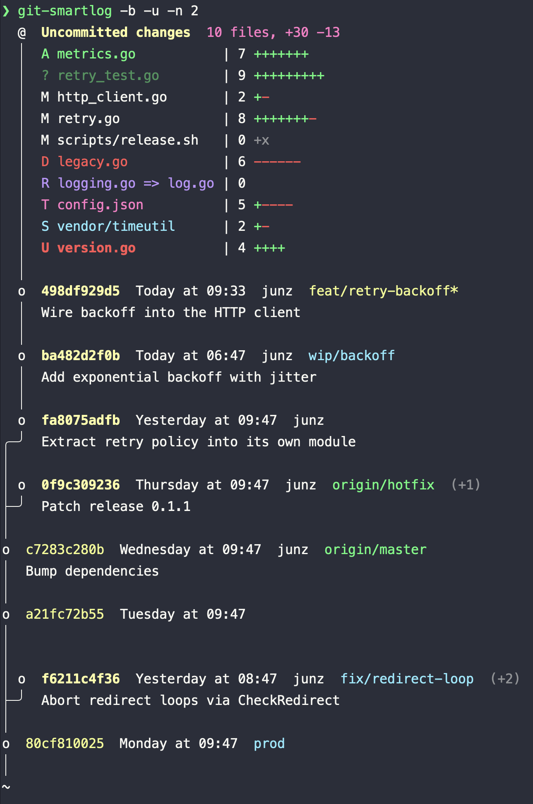
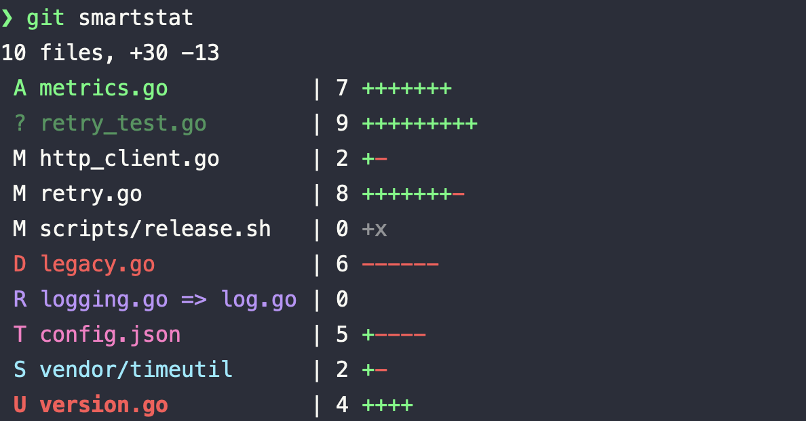

# git-smartlog

A [Sapling](https://sapling-scm.com/)-style `smartlog` for plain Git, in a single
self-contained zsh script. The same file doubles as
[`git-smartstat`](#git-smartstat), a standalone view of uncommitted changes.

It renders the current branch's **draft stack** — the first-parent chain of your
local (unpushed) commits — drawn on top of its nearest **public** (pushed) base,
with relative timestamps, authors, and ref decorations, closely mirroring the
output of Sapling's `sl`. Two opt-in extensions depart from that mirror: `-u`
adds an uncommitted-changes node, and `-b` folds your other local branches into
the graph — see below.

The story behind it is in
[this post](https://junz.info/writing/git-smartlog/).

<p align="center">
  
</p>

## Example

On a feature branch with a few local commits stacked on `origin/master`:

```text
$ git smartlog
  @  498df929d5  Today at 09:33  junz  feat/retry-backoff*
  │  Wire backoff into the HTTP client
  │
  o  ba482d2f0b  Today at 06:47  junz
  │  Add exponential backoff with jitter
  │
  o  fa8075adfb  Yesterday at 09:47  junz
╭─╯  Extract retry policy into its own module
│
o  c7283c280b  Wednesday at 09:47  junz  origin/master
│  Bump dependencies
~
```

`@` marks `HEAD`; the indented `o` nodes above the bend (`╭─╯`) are your unpushed
draft commits, newest first. Below the bend sits the public base — the nearest
pushed commit, here `origin/master` — and `~` marks the truncated history beyond
it.

Widen the public window with `-n`. Public commits authored by *someone else*
render metadata-only (no author, no subject), exactly as Sapling does — see
`a21fc72b55` and `80cf810025` below. Pass `-A` / `--all-authors` to turn that
off and show the author and subject for every commit, including other people's
public ones:

```text
$ git smartlog -n 4
  @  498df929d5  Today at 09:33  junz  feat/retry-backoff*
  │  Wire backoff into the HTTP client
  │
  o  ba482d2f0b  Today at 06:47  junz
  │  Add exponential backoff with jitter
  │
  o  fa8075adfb  Yesterday at 09:47  junz
╭─╯  Extract retry policy into its own module
│
o  c7283c280b  Wednesday at 09:47  junz  origin/master
│  Bump dependencies
│
o  a21fc72b55  Tuesday at 09:47
│
│
o  80cf810025  Monday at 09:47
│
~
```

With `-u` / `--uncommitted`, a synthetic **Uncommitted changes** node is drawn on
top of `HEAD` whenever the working tree is dirty: compact totals in the header,
per-file `git diff --stat HEAD` bars in the body. Loose untracked files are folded
into both (as new-file additions) via a throwaway index overlay, so they appear
without touching the real index; a **wholly-untracked directory collapses to a
single `dir/ | N files` entry** instead of expanding to every file inside it, just
like `git status`. Each body filename is prefixed with a one-letter change marker,
and both marker and name are color-coded by kind, on top of git's usual green/red
`+`/`-` bars. The body is **grouped by marker**, in the order below (sorted by path
within each group, matching `git status`):

| marker | meaning | color |
| :-: | --- | --- |
| `A` | added (staged) | green |
| `?` | untracked | dim green |
| `M` | modified | default |
| `D` | deleted | red |
| `R` | renamed | blue |
| `T` | typechange (file↔symlink) | magenta |
| `S` | submodule | cyan |
| `U` | unmerged (conflict) | bold red |

A pure executable-bit flip (`chmod`), which `--stat` renders as `| 0`, gets a
trailing `+x`/`-x` hint. The `@` marker moves to the node — that's where the working
copy is — and `HEAD` drops to an `o` (keeping its author and subject). This is a
git-smartlog extension with no Sapling equivalent, so the output no longer mirrors
`sl` (see [Differences](#differences-from-saplings-sl)):

```text
$ git smartlog -u -n 2
  @  Uncommitted changes  10 files, +30 -13
  │  A metrics.go           | 7 +++++++
  │  ? retry_test.go        | 9 +++++++++
  │  M http_client.go       | 2 +-
  │  M retry.go             | 8 +++++++-
  │  M scripts/release.sh   | 0 +x
  │  D legacy.go            | 6 ------
  │  R logging.go => log.go | 0
  │  T config.json          | 5 +----
  │  S vendor/timeutil      | 2 +-
  │  U version.go           | 4 ++++
  │
  o  498df929d5  Today at 09:33  junz  feat/retry-backoff*
  │  Wire backoff into the HTTP client
  │
  o  ba482d2f0b  Today at 06:47  junz
  │  Add exponential backoff with jitter
  │
  o  fa8075adfb  Yesterday at 09:47  junz
╭─╯  Extract retry policy into its own module
│
o  c7283c280b  Wednesday at 09:47  junz  origin/master
│  Bump dependencies
│
o  a21fc72b55  Tuesday at 09:47
│
~
```

With `-b` / `--branches`, every **other local branch** joins the graph too — as
a single node hanging off its fork point with the trunk, tagged with a dim `(+N)`
count of commits since that fork (the stack interior stays hidden). Branch names
render **cyan**, so they stand apart from green remote refs and the yellow active
branch. Fork points are added to the public column no matter how far down they
sit; commits skipped between them elide to Sapling's dotted `╷` spine (visible
with the default `-n 1` window). Two more rules keep the graph quiet: a branch
pointing at a commit already on screen just labels that commit instead of adding
a node (`wip/backoff` on a draft below, `prod` on a public commit), and a branch
whose same-name remote ref sits at the same commit shows only the remote name
(`origin/hotfix`). Everything composes with `-u` and `-n` — this is the cover
image up top:

```text
$ git smartlog -b -u -n 2
  @  Uncommitted changes  10 files, +30 -13
  │  A metrics.go           | 7 +++++++
  │  ? retry_test.go        | 9 +++++++++
  │  M http_client.go       | 2 +-
  │  M retry.go             | 8 +++++++-
  │  M scripts/release.sh   | 0 +x
  │  D legacy.go            | 6 ------
  │  R logging.go => log.go | 0
  │  T config.json          | 5 +----
  │  S vendor/timeutil      | 2 +-
  │  U version.go           | 4 ++++
  │
  o  498df929d5  Today at 09:33  junz  feat/retry-backoff*
  │  Wire backoff into the HTTP client
  │
  o  ba482d2f0b  Today at 06:47  junz  wip/backoff
  │  Add exponential backoff with jitter
  │
  o  fa8075adfb  Yesterday at 09:47  junz
╭─╯  Extract retry policy into its own module
│
│ o  0f9c309236  Thursday at 09:47  junz  origin/hotfix  (+1)
├─╯  Patch release 0.1.1
│
o  c7283c280b  Wednesday at 09:47  junz  origin/master
│  Bump dependencies
│
o  a21fc72b55  Tuesday at 09:47
│
│
│ o  f6211c4f36  Yesterday at 08:47  junz  fix/redirect-loop  (+2)
├─╯  Abort redirect loops via CheckRedirect
│
o  80cf810025  Monday at 09:47  prod
│
~
```

In a real terminal the output is colorized — draft hashes in bold yellow,
`HEAD`'s line in magenta, remote refs in green, `-b` branch names in cyan. ANSI is suppressed when stdout
isn't a TTY (as in these captures) or when `NO_COLOR` is set.

## Requirements

- `zsh`
- `git`

That's it. The script sources nothing else, so you can drop it anywhere on your
`PATH` and run it — `-u` included, since its stat block is computed in-file (see
[git-smartstat](#git-smartstat)).

## Install

```sh
curl -fsSL https://raw.githubusercontent.com/junzh0u/git-smartlog/master/git-smartlog \
  -o ~/.local/bin/git-smartlog
chmod +x ~/.local/bin/git-smartlog
# optional: the same file doubles as `git smartstat` (see below)
ln -s git-smartlog ~/.local/bin/git-smartstat
```

Because the script is named `git-smartlog` and lives on your `PATH`, Git picks it
up as a subcommand — run it as `git smartlog`. A short alias is handy:

```sh
git config --global alias.sl smartlog
```

## Usage

```
usage: git-smartlog [-u] [-A] [-b] [-n N] [--base REV]

  -u, --uncommitted   show a synthetic node for uncommitted working-tree changes
  -A, --all-authors   show author + subject for every commit, including public
                      commits by other authors (default: those render compact)
  -b, --branches      show every other local branch as a single node above its
                      fork point with the trunk, tagged (+N) commits since fork
  -n, --limit N       public commits to show, including the merge-base (default 1)
      --base REV      override the public base (default: nearest remote trunk, e.g.
                      origin/HEAD, origin/main, origin/master, upstream/main)
  -h, --help          show this help and exit
```

## git-smartstat

The uncommitted-changes block isn't just an add-on to the graph — it's also useful
on its own. `git-smartlog` is **multi-call**: the same file, invoked under the name
`git-smartstat`, prints *only* that block (the exact body `-u` draws) as a
standalone command. Symlink it and you get `git smartstat`:

```sh
ln -s git-smartlog ~/.local/bin/git-smartstat
```

```
usage: git-smartstat [--color WHEN]

      --color WHEN    colorize output: auto (default), always, or never
  -h, --help          show this help and exit
```

```text
$ git smartstat
10 files, +30 -13
 A metrics.go           | 7 +++++++
 ? retry_test.go        | 9 +++++++++
 M http_client.go       | 2 +-
 M retry.go             | 8 +++++++-
 M scripts/release.sh   | 0 +x
 D legacy.go            | 6 ------
 R logging.go => log.go | 0
 T config.json          | 5 +----
 S vendor/timeutil      | 2 +-
 U version.go           | 4 ++++
```

<p align="center">
  
</p>

Wholly-untracked directories collapse to a single entry — the way `git status`
lists a new directory — with a file count in place of the `+`/`-` graph,
right-justified into the same column as git's per-file line counts:

```text
$ git smartstat
3 files, +15 -0
 ? .cache/   |  2 files
 ? notes.txt | 14 ++++++++++++++
 M app.py    |  1 +
```

Paths are shown in full up to your terminal width; like `git diff --stat`, they
shorten to a leading `...tail` only when the terminal is too narrow to fit them
(piped output uses git's 80-column default).

It prints nothing when the working tree is clean. Both names share one in-file
function (`uncommitted_stat`), so there's no duplicated logic and `git-smartlog`
stays a single self-contained file — `-u` needs nothing external. (Standalone,
`git-smartstat` also works in a repo with no commits yet, diffing against the
empty tree so staged and untracked files still show as additions.)

## How it works

- **Public base** — the nearest public ancestor of `HEAD`. Candidate trunks are
  remote-tracking refs only (`origin/HEAD`, `upstream/HEAD`, `origin/main`,
  `origin/master`, `upstream/main`, `upstream/master`); among those, the one whose
  merge-base with `HEAD` is closest to `HEAD` wins. `@{u}` and a local
  `main`/`master` are last-resort fallbacks when no remote trunk exists.
- **Drafts** — first-parent commits in `HEAD ^base`, newest first.
- **Uncommitted changes** — with `-u`/`--uncommitted`, when `git status` is
  non-empty, a synthetic node on top of `HEAD`: compact totals in the header
  (`git diff --shortstat`) and per-file `git diff --stat HEAD` bars in the body,
  both computed against a throwaway index overlay that intent-to-adds loose
  untracked files so they're folded in without mutating the repo (a wholly-untracked
  directory instead collapses to one `dir/ | N files` entry, like `git status`).
  Each body filename gets a
  one-letter change marker (`A`/`?`/`M`/`D`/`R`/`T`/`S`/`U`, from `git diff --raw`,
  plus the porcelain status for conflicts) colored by kind (see the `-u` table
  above), and a `+x`/`-x` hint on executable-bit flips; the `@`
  marker moves there. This block is computed by the in-file `uncommitted_stat`
  function — the same code the [`git-smartstat`](#git-smartstat) command runs.
- **Public window** — `-n` commits starting at the base.
- **Other branches** — with `-b`/`--branches`, every other local branch joins the
  graph as a single node (its head commit) above its fork point with the trunk,
  tagged with a dim `(+N)` count of commits since that fork; branch names render
  cyan so they stand apart from green remote refs. Fork points are added to the
  public column, with skipped commits eliding to Sapling's dotted `╷` spine. A
  branch merged into the trunk — or pointing at a commit already on screen —
  labels that commit instead of adding a node, and a branch whose same-name
  remote ref sits at the same commit shows only the remote name.
- **Relative time** — mirrors Sapling's `smartdate`: `age()` ("N minutes ago")
  within 90 minutes, calendar-day `simpledate()` ("Yesterday", "Mon DD", …)
  beyond it.
- **Color** — ANSI, automatically suppressed when stdout isn't a TTY or `NO_COLOR`
  is set.

## Differences from Sapling's `sl`

- **Single stack only.** It renders the current `HEAD`'s first-parent draft chain
  plus its public base. Sapling renders *every* draft branch as its own stack via
  a full DAG renderer; this script deliberately does not, so other local branches
  and draft heads won't appear by default. Output matches `sl` exactly when you're
  working a single branch (the common case).
- **`-b`/`--branches` is an extension.** Other local branches appear as single
  elided nodes with a `(+N)` commits-since-fork tag, where Sapling would draw
  each branch's full stack (and has no `(+N)`); branch names are cyan rather than
  Sapling's green `sl.book`, so local branches read differently from remote refs.
  A branch forking from a draft of the current stack is approximated: its node
  hangs off the shared trunk fork point and `(+N)` includes the shared drafts.
- **Long subjects shown in full.** Sapling truncates them to the terminal width
  with an ellipsis.
- **`-u` is an extension, not a mirror.** The default output tracks Sapling's `sl`
  closely, but the `-u`/`--uncommitted` node (with its `git diff --stat` body) has
  no Sapling equivalent — the idea is borrowed from [Jujutsu](https://github.com/jj-vcs/jj),
  which treats the working copy as a commit in its own right; Sapling surfaces
  working-copy changes differently. Treat `-u` as a git-smartlog-only convenience,
  not a parity feature.
- **`-A`/`--all-authors` is an extension.** By default, public commits by other
  authors render metadata-only, exactly as Sapling does. `-A` turns that off and
  shows the author and subject for every commit — handy on shared branches where
  you want to see who did what. Sapling has no equivalent toggle; the default
  output is unchanged.

## License

[MIT](LICENSE)
